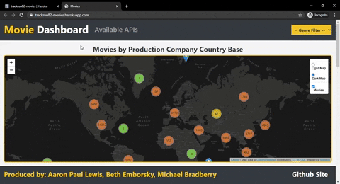
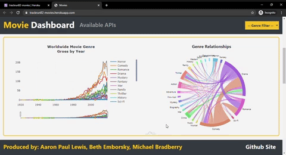
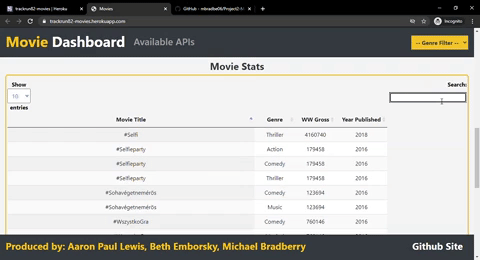
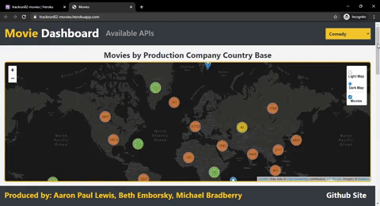
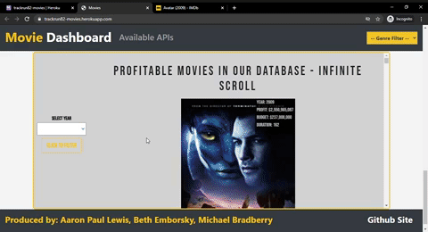

# Project 2 - Movie Dashboard

The goals of this project were to:
* Tell a story through data visualizations
* Focus on users being able to interact with data

## RESTful API

* 2 files were downloaded and extracted from [Kaggle website](https://www.kaggle.com/stefanoleone992/imdb-extensive-dataset)
	* [IMDb movies.csv](https://www.kaggle.com/stefanoleone992/imdb-extensive-dataset?select=IMDb+movies.csv)
	* [IMDb names.csv](https://www.kaggle.com/stefanoleone992/imdb-extensive-dataset?select=IMDb+names.csv)
* Database was created in PostgreSQL Server using
	* [Movie ERD Diagram](https://github.com/trackrun82/Project2fun/blob/master/Project%202%20Movie%20ERD.pdf)
	* [Movie Jupyter Notebook](https://github.com/trackrun82/Project2fun/blob/master/Main_ETL_project2.ipynb)
* Database [Movies Backup](https://github.com/trackrun82/Project2fun/blob/master/movies%20backup) was uploaded and is hosted on Heroku
* Python Flask-powered routes were created to access data [app.py](https://github.com/trackrun82/Project2fun/blob/master/app.py)

## Website Forming

* Basic forming of website was created using [index.html](https://github.com/trackrun82/Project2fun/blob/master/templates/index.html)
* Inital loading of website utilizes [loader.svg](https://github.com/trackrun82/Project2fun/blob/master/static/images/loader.svg)
* The code for formulating the map, charts and table sections is located in [app.js](https://github.com/trackrun82/Project2fun/blob/master/static/js/app.js)
* The code for formulating the posters section is located in [appPoster.js](https://github.com/trackrun82/Project2fun/blob/master/static/js/appPoster.js)

## Initial Page Load and Links

* Initial page load/Clicking on Movie Dashboard/Refreshing view
	* Any of these actions will initiate page load with loader in background until all initial posters have been retrieved from the API:

* Once the loader goes away, the initial page is viewable:

* The view is responsive with changes in webpage size:

* A list of clickable APIs is available via the top toolbar:

* A link to the project Github Repo is available via the bottom toolbar:

## Map Section -

* A map was created using Leaflet that plots all of the movies based on their latitude and longitude
	* Clustered data markers were added and they represent the movies production company country of origin
	* When an individual marker is hovered over, the country of origin is displayed
	* Popups provide additional information about the movie when a marker is clicked and also provide a link to the movie on IMDB.com

## Chart Section -

* A line chart was formed by grouping movies together by genre and displaying worldwide gross totals by year
	* When a year is hovered over, the data is displayed in descending order
	* A rangeslider is provided at the bottom to zoom in on desired years

* A chord diagram was formed as well using a new Javascript library [amCharts](https://www.amcharts.com/demos/chord-diagram/)
	* The chord diagram describes the relationships between movies with 2 or more genres listed
	* Only the first 2 genres listed were used to simplify the diagram 
	* Only movies that had a worldwide gross total listed in the database were used to align with the line chart
	* When hovered over, the number of movies with the linked genres is displayed

## Table Section -

* A table was created using a new Javascript library [datatables](https://datatables.net/)
	* The table is interactive and able to be searched and sorted
	* Similar to the Chart Section, only movies that had a worldwide gross total listed were included in the table

## Filtering by Genre -

* A genre filter for the map, line chart and table is accessed via the top toolbar
	* The map updates to show only movies that are within selected genre
	* The line chart shows only the data for the selected genre
	* The table shows only the movies for the selected genre and is still interactive

## Infinite Scrolling Section -

* An infinite scrolling section of posters of movies that were profitable was formed in descending order by profit
	* The posters are able to be filtered by production year
	* Each poster is clickable and will take user to that movie on IMDB.com similar to the maps section

## Finalizations

The website is published and hosted at [Heroku](https://trackrun82-movies.herokuapp.com/) utilizing the necessary files:
* [Requirements](https://github.com/trackrun82/Project2fun/blob/master/requirements.txt)
* [Procfile](https://github.com/trackrun82/Project2fun/blob/master/Procfile)

